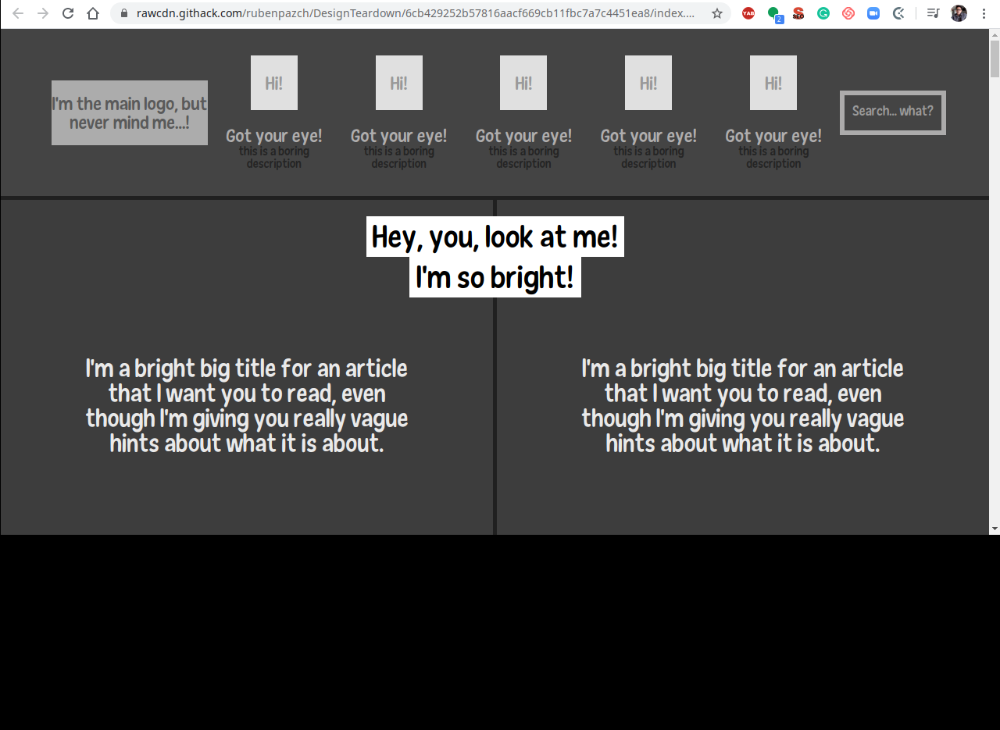

# Smashing magazine Page Clone

> This project consists of building a heatmap of the Smashing magazine website

## Built With

- HTML
- fontawesome
- CSS
- Floats and Positioning

## Live Demo

[Preview](https://rawcdn.githack.com/rubenpazch/DesignTeardown/6cb429252b57816aacf669cb11fbc7a7c4451ea8/index.html)

## Authors

👤 **Pedro Henrique Ferreira Donda**

- Github: [@phfdonda](https://github.com/phfdonda)
- LinkedIn: [phfdonda](https://www.linkedin.com/in/pedro-donda-808621bb/)

👤 **Ruben Paz Chuspe**

- Github: [@rubenpazch](https://github.com/rubenpazch)
- Linkedin: [rubenpch](https://www.linkedin.com/in/rubenpch/)

## 🤝 Contributing

Contributions, issues and feature requests are welcome!

Feel free to check the [issues page](issues/).

## Show your support

Give a ⭐️ if you like this project!

## Acknowledgments

- Hat tip to anyone whose code was used
- Inspiration
- etc

## 📝 License

This project is [MIT](lic.url) licensed.
